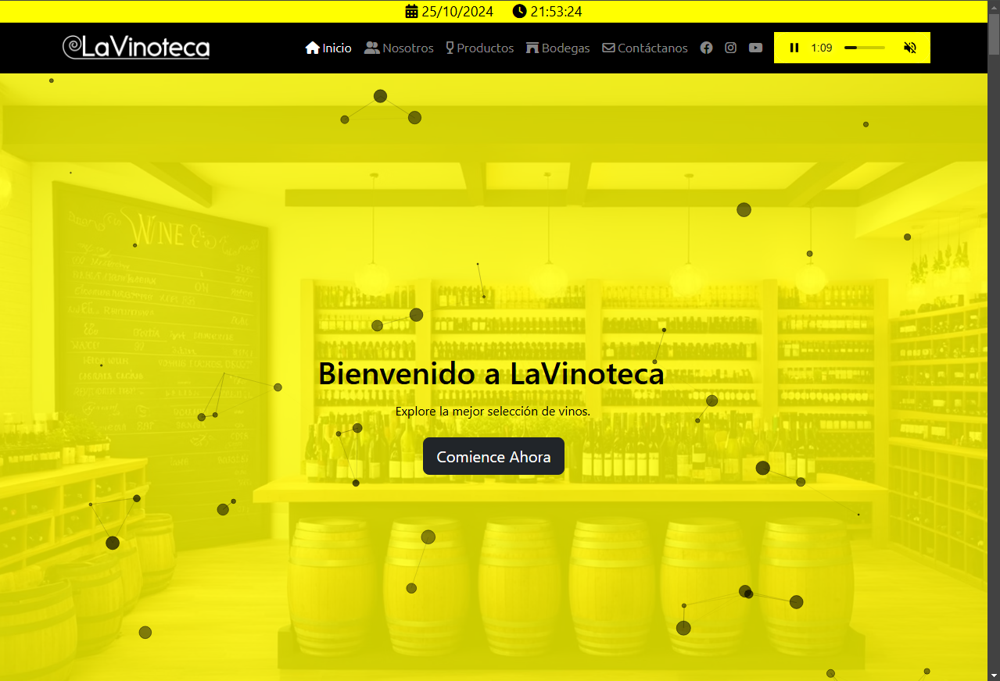
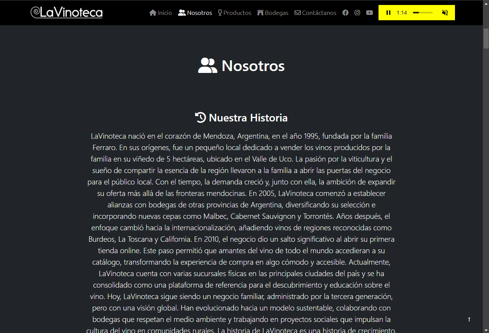
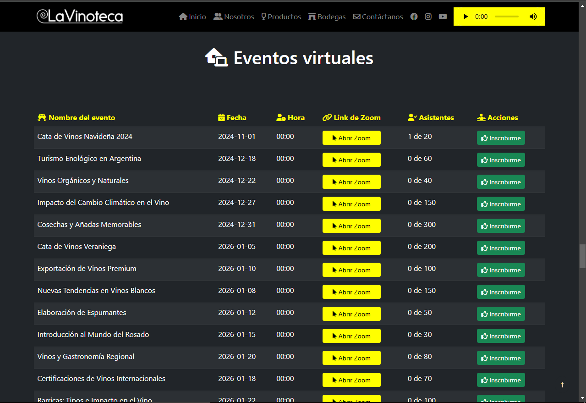
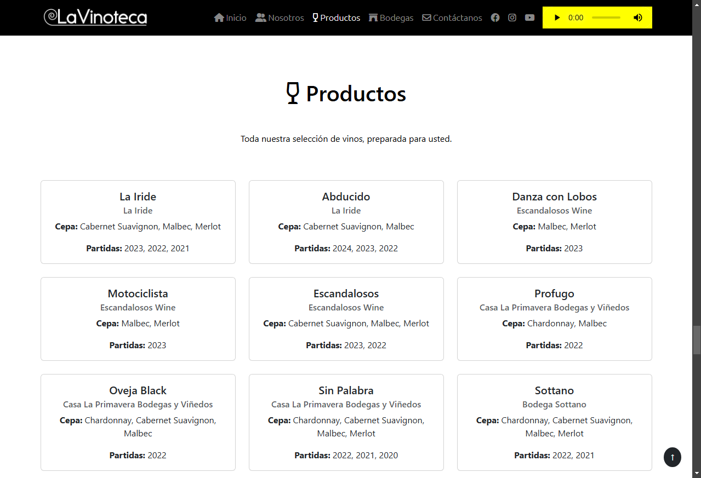
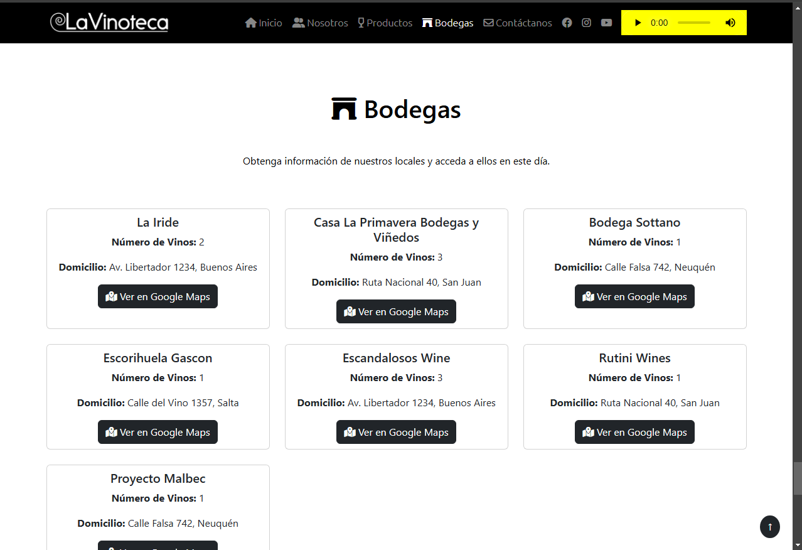
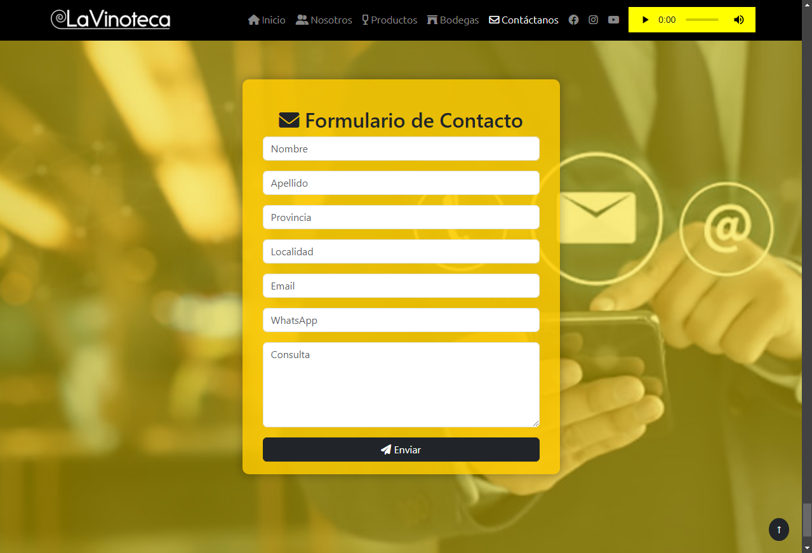
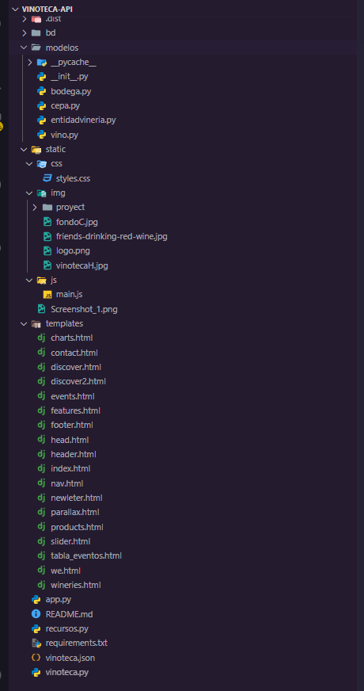

<!--# Proyecto LaVinoteca -->
<h1 style="text-align: center;">Proyecto LaVinoteca</h1>

## Descripción
El proyecto LaVinoteca fue desarrollado para el integrador final de programación 2 de la carrera Tecnicatura Universitaria en Desarrollo Web dictada por la Uneres y es un sito web que permite a los usuarios explorar y visualizar una colección de vinos obtenida de una API interna. La interfaz está diseñada para ser intuitiva y responsiva, permitiendo a los usuarios acceder fácilmente a la información sobre los diferentes vinos y bodegas.

## Imágenes

## Tecnologías Utilizadas ---> Stack WEB-FM (Stack FMJB+)
- **HTML5**: Para la estructura básica del sitio web.
- **CSS3**: Para el diseño y estilo de la aplicación, utilizando Bootstrap para asegurar una experiencia responsiva.
- **JavaScript**: Para la lógica de la aplicación, incluyendo la manipulación del DOM y la interacción con la API.
- **Bootstrap**: Framework CSS que facilita la creación de un diseño responsivo y moderno.
- **Fetch API**: Para realizar solicitudes a la API de vinos y obtener datos de forma asincrónica.
- **Flask**: Backend.
- **MySql**: Base de datos relacional.

   
   
   
   
  

## Funcionalidades
- **Visualización de Vinos**: Los usuarios pueden ver una lista de vinos con detalles básicos, como nombre, tipo, y año, obtenidos de la API.
- **Visualización de Bodegas**: Lista de bodegas con nombre, domicilio y mapa, proporcionado por la API Rest.
- **Eventos Online**: Suscripción a eventos online.
- **Formulario de contacto**: Al completar los datos, se puede envíar a un determinado email.

## Bibliotecas necesarias para ejecutarlo
- **Flask y Flask-RESTful**: pip install Flask Flask-RESTful
- **Flask-CORS (para habilitar solicitudes CORS)**: pip install Flask-Cors
- **Flask-MySQLdb (interfaz para MySQL)**: pip install Flask-MySQLdb
- **MySQLdb (Driver MySQL para Python)**: pip install mysqlclient
- **Todas de un sólo paso**: pip install Flask Flask-RESTful Flask-Cors Flask-MySQLdb mysqlclient

## Estructura del Proyecto

## Proyecto desplegado para pruebas 
- **Web**: https://lavinoteca.onrender.com/
- **Api Rest**: https://lavinoteca.onrender.com/api/bodegas
- **Api Rest**: https://lavinoteca.onrender.com//api/vinos
